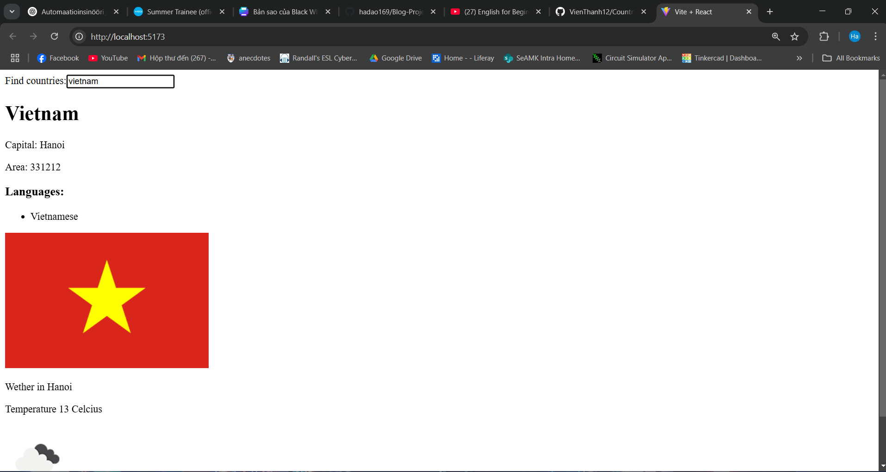
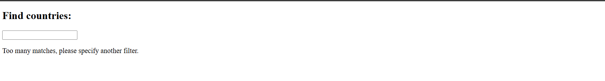
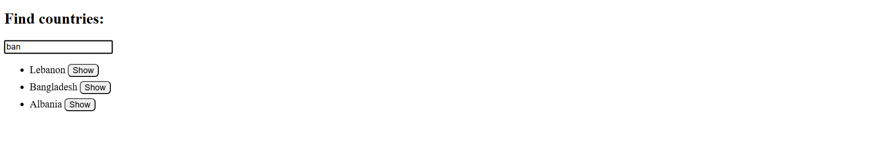
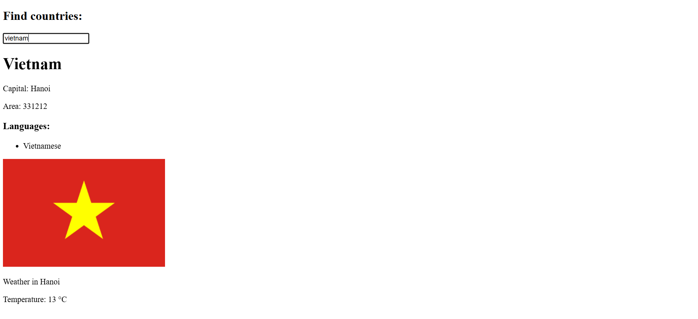

# Personal Project

## Basic information of a country

## Project Description

- If there are too many (over 10) countries that match the query, then the user is prompted to make their query more specific:
  

- If there are ten or fewer countries, but more than one, then all countries matching the query are shown
- There is a button next to the name of the country, which when pressed shows the view for that country
  

- When there is only one country matching the query, then the basic data of the country (eg. capital and area), its flag and the languages spoken as well as weather are shown:
  
